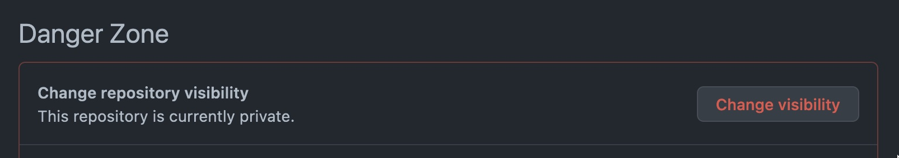
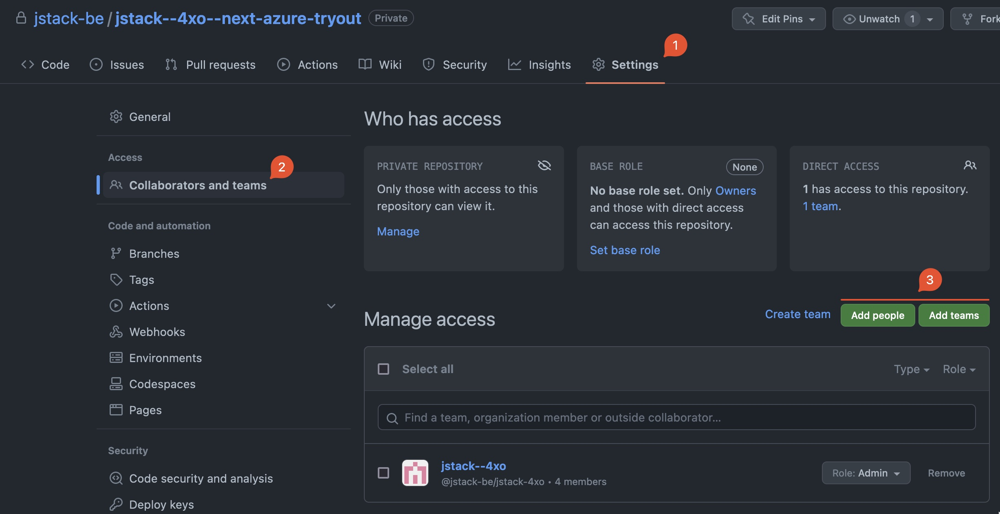
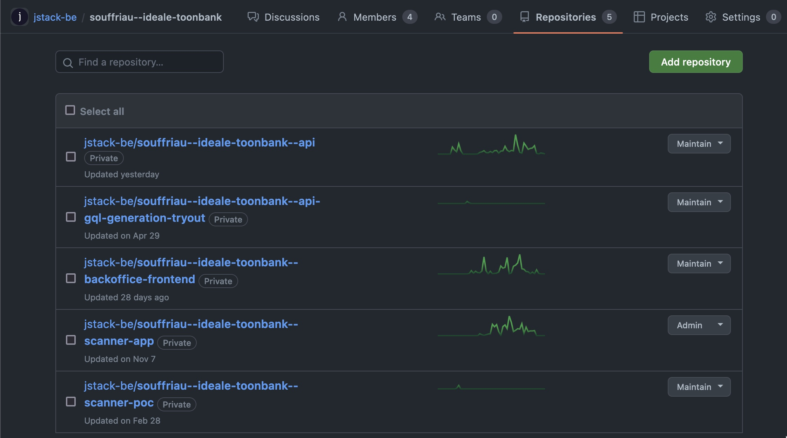

# Contributing to jstack codebases

Normally, the `CONTRIBUTING.md` file contains information on how to contribute to a single repository or project,
but this one helps you in becoming a good jstackian developer.

## Repositories
  
### Repository visibility  
Unless you are working on an open source project for jstack, choose a private repository when creating one.  
You can always change the visibility of a repo after creating it under Settings > General > Danger Zone  
  

You will be the owner of the repo you created and will be able to allow access to the necessary team members
 or teams through the repository settings.

 

### Repository naming

When naming your repositories, try to stick to the `context--project--part` pattern.  
We'll illustrate this with some examples:  
  
Let's say you're responsible for the backend/server/API for the 'Cemently' solution for our new client, John Cement Ltd.  
You would create the `john-cement--cemently--api` repository to house your codebase.  
If you are starting development on the web app part of that project, you would create `john-cement--cemently--web`.
  
Imagine jstack is going to develop their own invoicing application that will consist of a backend, an app, and some scripts.  
You would end up with `jstack--invoiceroo--api`, `jstack--invoiceroo--app`, and `jstack--invoiceroo--scripts`.
  
If you are an intern, you can start your repository names with `internship--`.  
Examples would be `internship--musicians--api` and `internship--incrudible--server`.

## Teams

We aim to use Github's teams functionality to regulate access to repositories, workflows, settings, etc  .
When starting up a new project, it's a good idea to create a team for it and include only the necessary team members in it.  
  
Teams should be named like `@jstack-be/client--project`, or if you have multiple 'responsibilities': `@jstack-be/client--project--responsibility`.  
For the 'Cemently' example discussed above, we would create team `@jstack-be/john-cement--cemently` and give it Maintainer access on `john-cement--cemently--api` and `john-cement--cemently--web`.  
  
If we stick to this way of working, it is trivially easy to give people access to the things they need.  
Here is an example of real team used for a real project.  

Their access to some repos that are relevant to the project.

Note that every repo is private, but all team members will have Maintainer access because they inherit the team's access.